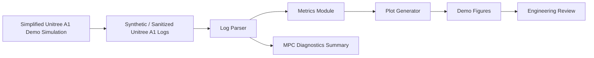

# Unitree A1 仿真控制公开展示

[](https://github.com/zihanshen29/robot-a1-showcase/actions/workflows/ci.yml)

这是一个面向作品集和中文岗位投递的 sanitized showcase 仓库，用 Unitree A1 主题的合成数据展示机器人仿真控制项目的工程表达方式：日志生成、字段校验、指标计算、MPC 风格诊断、图表生成、测试和对外说明。

所有 CSV、指标和图表均为 synthetic demo artifacts。它们用于说明可复现分析流程，不代表真实硬件性能，不披露原始非公开项目代码或数据。

## English Summary

This is a sanitized, runnable Unitree A1 robotics simulation-control showcase. It demonstrates synthetic log generation, parser validation, metrics, MPC-style diagnostics, plotting, tests, and engineering documentation. The repository does not claim real hardware results and does not include non-public source code, raw logs, checkpoints, SDK integrations, credentials, or internal paths.

## 这个仓库是什么

- 一个可运行的公开展示库，用于说明机器人项目中的数据接口、分析流程和工程边界。
- 一套 deterministic synthetic Unitree A1 600-step demo logs。
- 一个带 schema 校验的 CSV parser，缺字段时会给出明确错误。
- 一组 demo metrics：前向位移、速度跟踪误差、base height、姿态、MPC accept/reject、predicted support force、cost trend、contact duty factor 和运行时长。
- 一套可复现图表，用于工程复盘与技术审阅。
- 一组测试，覆盖 parser、metrics、pipeline smoke、600-step 字段和 model name 一致性。

## 这个仓库不是什么

这个仓库不是原始科研或实习代码库，不包含 Isaac、ROS、Unitree SDK、真实机器人日志、checkpoint、原始求解器代码、机器本地路径、凭据或内部服务细节。`src/a1_showcase/simple_sim.py` 是简化展示模拟，不是真实 Unitree A1 动力学模型。

## 展示页

GitHub Pages 入口：

https://zihanshen29.github.io/robot-a1-showcase/

展示页包含候选人信息、关键 synthetic/demo 指标卡片、3 张主要图表、毕设进度 Mermaid Gantt、GitHub 文档链接和统一 Showcase Series footer。

## Verified project metrics (thesis scope)

以下为毕设实测指标的文字引用；本仓库生成的 CSV、JSON 和图表仍为 synthetic demo artifacts，不与这些实测数字混作同一数据源。

### Table A1-1. Short-horizon results

| Controller | 600-step forward displacement | Notes |
| --- | --- | --- |
| PPO `model_298.pt` | +0.9338 m | corrected replay |
| Hardcoded diagonal-trot baseline | +0.9339 m | hand-written baseline |
| MPC defaults | +0.7915 m | parameter comparison |

### Table A1-2. Key experiment comparisons

| Experiment | Survival steps | Key metric | Conclusion |
| --- | --- | --- | --- |
| 600-step validation | 600 | PPO +0.9338 m ~= baseline +0.9339 m | short-horizon validation passed |
| 1200-step pressure test | about 872 | policy and baseline both failed | shared control-stack issue, not a pure RL issue |
| yaw-anchor single run | 1199 | accept 164/1199 | failed branch: longer survival did not mean healthier control |

### Table A1-3. Debugging checklist

| # | Issue | Fix |
| --- | --- | --- |
| 1 | warmup residual leak | blocked residual from entering the warmup control path |
| 2 | train/play mismatch | corrected replay path and evaluation semantics |
| 3 | acceptance gate instability | tightened recovery-specific cost gating |
| 4 | contact structure drift | locked contact structure to diagonal trot |
| 5 | timing residual too wide | narrowed residual timing scale |
| 6 | curriculum instability | staged curriculum and z-min threshold |
| **7** | **MPC solve cadence** | **key finding: `mpc_rate_div` 6->1** |

### Table A1-4. System parameters

| Parameter | Value |
| --- | --- |
| Control rate | 50 Hz control with 0.005 s physics step |
| Observation | 54-D observation with MPC health information |
| Action | 5-D gait action: 4 contact channels + 1 timing channel |
| MPC preview | 35-step contact-sequence preview, about 0.7 s |
| Bridge | Windows-to-WSL2 TCP bridge |
| Solver | Crocoddyl FDDP |
| Scale | about 2,500 lines of custom code; 80+ analysis scripts; 112 CSV files; 50+ documents |

口径纪律：600 steps 是短时域验证，1200 steps 是压力测试；不能把该结果表述为通用四足行走已解决，也不能暗示实机部署。

## Thesis replay clips

These clips are Isaac Lab simulation replays from 2026-04 within the thesis scope. They are separate from the synthetic demo figures generated by this public repository.

<video controls muted preload="metadata" poster="docs/assets/media/a1_baseline_trot_600step_poster.jpg" src="docs/assets/media/a1_baseline_trot_600step.mp4"></video>

Caption: Isaac Lab simulation replay (2026-04, thesis scope) — hardcoded diagonal-trot baseline, corresponding to Table A1-1 baseline +0.9339 m.

<video controls muted preload="metadata" poster="docs/assets/media/a1_rl_policy_600step_poster.jpg" src="docs/assets/media/a1_rl_policy_600step.mp4"></video>

Caption: Isaac Lab simulation replay (2026-04, thesis scope) — PPO `model_298.pt`, corresponding to Table A1-1 PPO +0.9338 m.

## 架构



## 状态矩阵

| 能力 | 本仓库包含 | 边界 |
| --- | --- | --- |
| Unitree A1 demo data | 是，synthetic CSV logs | 不是真实硬件遥测 |
| 日志解析 | 是，带 schema 校验 | 不是非公开日志格式解析器 |
| MPC 诊断 | 是，accept/reject、cost、support-force 风格字段 | 不是生产 MPC 求解器 |
| 图表 | 是，600-step demo plots | 不是实验结果 |
| 长时域运动稳定性 | 作为限制讨论 | 不宣称已解决 |
| 真实机器人验证 | 明确不在范围内 | 无硬件部署声明 |
| 开门任务 | 作为未来/边界上下文讨论 | 未实现、未评估 |

## 快速开始

Windows PowerShell:

```powershell
python -m venv .venv
.\.venv\Scripts\Activate.ps1
pip install -e ".[test]"
python scripts\generate_sample_data.py
python scripts\run_demo_pipeline.py
pytest
```

Linux/macOS:

```bash
python -m venv .venv
source .venv/bin/activate
pip install -e ".[test]"
python scripts/generate_sample_data.py
python scripts/run_demo_pipeline.py
pytest
```

## Demo Pipeline

1. `scripts/generate_sample_data.py` 在 `data/sample_logs/` 下创建 deterministic CSV logs。
2. `scripts/parse_logs.py` 校验必需字段，并写出 `outputs/metrics/parsed_summary.csv`。
3. `scripts/run_demo_pipeline.py` 计算指标并写出 A1 figures。
4. `pytest` 检查 parser、metrics、600-step 数据字段、model-name 一致性和端到端 smoke 行为。

## 生成图表

A1 pipeline 会在 `outputs/figures/` 下写出以下图表：

- `a1_600_step_forward_displacement.png`
- `a1_base_height.png`
- `a1_roll_pitch.png`
- `a1_mpc_accept_reject.png`
- `a1_predicted_support_force.png`
- `a1_cost_trend.png`
- `a1_velocity_tracking.png`
- `a1_metrics_summary.png`

展示页使用 `docs/images/` 中复制的 3 张关键图：forward displacement、MPC accept/reject、cost trend。页面说明聚焦数据接口、指标计算、诊断图表和工程复盘。

## 仓库结构

```text
robot-a1-showcase/
|-- README.md
|-- pyproject.toml
|-- requirements.txt
|-- data/
|   |-- README.md
|   `-- sample_logs/
|-- docs/
|   |-- images/
|   |-- assets/
|   |-- architecture.md
|   |-- index.html
|   |-- limitations_and_ethics.md
|   `-- project_overview.md
|-- src/
|   `-- a1_showcase/
|-- scripts/
|-- tests/
`-- outputs/
```

## 工程复盘摘要

- 我把一个不适合直接公开的 Unitree A1 仿真控制项目，整理成了可运行、可测试、可解释的公开 showcase。
- 核心工程链路是：生成或接收日志，校验字段，计算指标，可视化诊断，并用测试保护流程。
- 600-step 图表便于快速检查 tracking、base-height、support-force、cost 和 accept/reject 行为；毕设实测口径中 PPO 为 +0.9338 m，hardcoded baseline 为 +0.9339 m。
- MPC accept/reject 与 predicted support-force 图能把高层 gait intent 和 feasibility-style diagnostics 联系起来。
- 1200-step pressure test 的关键结论是约 872 step 共同失败窗口，后续优化方向在共享控制栈与 MPC 侧，而不是简单归因 RL。
- 项目对边界保持诚实：长时域鲁棒性、真实机器人验证和开门任务迁移都没有在这个公开 demo 中宣称完成。
- 如果未来有可公开的 Unitree A1 或仿真器日志，可以在脱敏审查后复用同一 parser contract 接入。

## 限制与合规

本仓库避免不受支持的性能声明，不把 synthetic metrics 包装成真实实验，不包含非公开实现细节，也不暗示实机部署。目标是展示工程判断、分析结构、可复现性和沟通质量，同时保护源项目。
