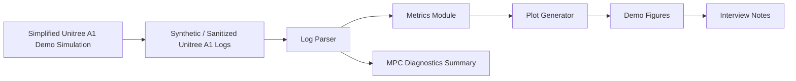

# Unitree A1 仿真控制公开展示

这是一个面向作品集和中文岗位投递的 sanitized showcase 仓库，用 Unitree A1 主题的合成数据展示机器人仿真控制项目的工程表达方式：日志生成、字段校验、指标计算、MPC 风格诊断、图表生成、测试和对外说明。

所有 CSV、指标和图表均为 synthetic demo artifacts。它们用于说明可复现分析流程，不代表真实硬件性能，不披露原始非公开项目代码或数据。

## English Summary

This is a sanitized, runnable Unitree A1 robotics simulation-control showcase. It demonstrates synthetic log generation, parser validation, metrics, MPC-style diagnostics, plotting, tests, and interview-ready documentation. The repository does not claim real hardware results and does not include non-public source code, raw logs, checkpoints, SDK integrations, credentials, or internal paths.

## 这个仓库是什么

- 一个可运行的公开展示库，用于说明机器人项目中的数据接口、分析流程和工程边界。
- 一套 deterministic synthetic Unitree A1 600-step demo logs。
- 一个带 schema 校验的 CSV parser，缺字段时会给出明确错误。
- 一组 demo metrics：前向位移、速度跟踪误差、base height、姿态、MPC accept/reject、predicted support force、cost trend、contact duty factor 和运行时长。
- 一套可复现图表，适合面试或作品集讲解。
- 一组测试，覆盖 parser、metrics、pipeline smoke、600-step 字段和 model name 一致性。

## 这个仓库不是什么

这个仓库不是原始科研或实习代码库，不包含 Isaac、ROS、Unitree SDK、真实机器人日志、checkpoint、原始求解器代码、机器本地路径、凭据或内部服务细节。`src/a1_showcase/simple_sim.py` 是简化展示模拟，不是真实 Unitree A1 动力学模型。

## 展示页

GitHub Pages 入口：

https://zihanshen29.github.io/robot-a1-showcase/

展示页包含候选人信息、关键 synthetic/demo 指标卡片、3 张主要图表、毕设进度 Mermaid Gantt、GitHub 文档链接和统一 Showcase Series footer。

## 架构



## 状态矩阵

| 能力 | 本仓库包含 | 边界 |
| --- | --- | --- |
| Unitree A1 demo data | 是，synthetic CSV logs | 不是真实硬件遥测 |
| 日志解析 | 是，带 schema 校验 | 不是非公开日志格式解析器 |
| MPC 诊断 | 是，accept/reject、cost、support-force 风格字段 | 不是生产 MPC 求解器 |
| 图表 | 是，600-step demo plots | 不是实验结果 |
| 长时域运动稳定性 | 作为限制讨论 | 不宣称已解决 |
| 真实机器人验证 | 明确不在范围内 | 无硬件部署声明 |
| 开门任务 | 作为未来/边界上下文讨论 | 未实现、未评估 |

## 快速开始

Windows PowerShell:

```powershell
python -m venv .venv
.\.venv\Scripts\Activate.ps1
pip install -r requirements.txt
python scripts\generate_sample_data.py
python scripts\run_demo_pipeline.py
pytest
```

Linux/macOS:

```bash
python -m venv .venv
source .venv/bin/activate
pip install -r requirements.txt
python scripts/generate_sample_data.py
python scripts/run_demo_pipeline.py
pytest
```

## Demo Pipeline

1. `scripts/generate_sample_data.py` 在 `data/sample_logs/` 下创建 deterministic CSV logs。
2. `scripts/parse_logs.py` 校验必需字段，并写出 `outputs/metrics/parsed_summary.csv`。
3. `scripts/run_demo_pipeline.py` 计算指标并写出 demo figures。
4. `pytest` 检查 parser、metrics、600-step 数据字段、model-name 一致性和端到端 smoke 行为。

## 生成图表

demo pipeline 会在 `outputs/figures/` 下写出以下 synthetic/sanitized 图表：

- `demo_600_step_forward_displacement.png`
- `demo_base_height.png`
- `demo_roll_pitch.png`
- `demo_mpc_accept_reject.png`
- `demo_predicted_support_force.png`
- `demo_cost_trend.png`
- `demo_velocity_tracking.png`
- `demo_metrics_summary.png`

展示页使用 `docs/images/` 中复制的 3 张关键图：forward displacement、MPC accept/reject、cost trend。图片标题和页面说明均标注 Demo 或 Synthetic 边界。

## 仓库结构

```text
robot-a1-showcase/
|-- README.md
|-- pyproject.toml
|-- requirements.txt
|-- data/
|   |-- README.md
|   `-- sample_logs/
|-- docs/
|   |-- images/
|   |-- architecture.md
|   |-- index.html
|   |-- interview_talking_points.md
|   |-- limitations_and_ethics.md
|   `-- project_overview.md
|-- src/
|   `-- a1_showcase/
|-- scripts/
|-- tests/
`-- outputs/
```

## 面试讲解重点

- 我把一个不适合直接公开的 Unitree A1 仿真控制项目，整理成了可运行、可测试、可解释的公开 showcase。
- 核心工程链路是：生成或接收日志，校验字段，计算指标，可视化诊断，并用测试保护流程。
- 600-step 图表便于快速检查 tracking、base-height、support-force、cost 和 accept/reject 行为。
- MPC accept/reject 与 predicted support-force 图能把高层 gait intent 和 feasibility-style diagnostics 联系起来。
- 项目对边界保持诚实：长时域鲁棒性、真实机器人验证和开门任务迁移都没有在这个公开 demo 中宣称完成。
- 如果未来有可公开的 Unitree A1 或仿真器日志，可以在脱敏审查后复用同一 parser contract 接入。

## 限制与合规

本仓库避免不受支持的性能声明，不把 synthetic metrics 包装成真实实验，不包含非公开实现细节，也不暗示真实机器人部署。目标是展示工程判断、分析结构、可复现性和沟通质量，同时保护源项目。
