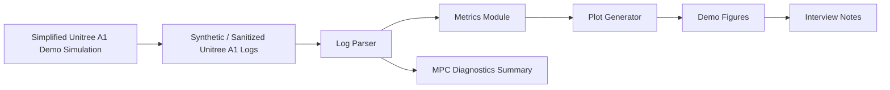

# Unitree A1 Robotics Simulation Control Showcase

## What This Repository Is

This is a sanitized, simplified, runnable showcase repository for a Unitree A1 robotics simulation control workflow. It demonstrates engineering practices around synthetic log generation, parser validation, metric calculation, MPC-style diagnostics, plotting, tests, and interview-ready documentation.

All metrics, CSV logs, and figures in this repository are synthetic demo artifacts. They are designed to show a reproducible analysis pipeline, not to claim real hardware performance or disclose the original non-public project.

## What This Repository Is Not

This is not the original research or internship codebase. It does not include Isaac, ROS, a Unitree SDK, real robot logs, checkpoints, original solver code, machine-specific paths, credentials, or internal service details. The simplified simulation in `src/a1_showcase/simple_sim.py` is not a real Unitree A1 dynamics model.

## Project Highlights

- Deterministic synthetic Unitree A1 600-step demo logs.
- CSV parser with explicit schema validation and clear errors.
- Demo metrics for forward displacement, tracking error, base height stability, attitude, MPC accept/reject counts, predicted support forces, cost trend, contact duty factor, and run duration.
- Reproducible figure generation for interview and portfolio discussion.
- Tests for parser behavior, metric outputs, pipeline smoke coverage, 600-step fields, and model-name consistency.
- Documentation that separates showcase value from unsupported claims.

## Architecture



## Status Matrix

| Capability | Included here | Boundary |
| --- | --- | --- |
| Unitree A1 demo data | Yes, synthetic CSV logs | Not real hardware telemetry |
| Log parsing | Yes, schema-checked CSV parser | Not a parser for non-public log formats |
| MPC diagnostics | Yes, accept/reject, cost, support-force style fields | Not a production MPC solver |
| Figures | Yes, demo 600-step plots | Not experimental results |
| Long-horizon locomotion | Discussed as a limitation | Not claimed solved |
| Real robot validation | Explicitly out of scope | No hardware deployment claim |
| Door task | Discussed as future/boundary context | Not implemented or evaluated |

## Quick Start

```powershell
python -m venv .venv
.\.venv\Scripts\Activate.ps1
pip install -r requirements.txt
python scripts\generate_sample_data.py
python scripts\run_demo_pipeline.py
pytest
```

Linux/macOS:

```bash
python -m venv .venv
source .venv/bin/activate
pip install -r requirements.txt
python scripts/generate_sample_data.py
python scripts/run_demo_pipeline.py
pytest
```

## Demo Pipeline

The pipeline runs from synthetic/sanitized sample logs to metrics and figures:

1. `scripts/generate_sample_data.py` creates deterministic CSV logs under `data/sample_logs/`.
2. `scripts/parse_logs.py` validates required fields and writes `outputs/metrics/parsed_summary.csv`.
3. `scripts/run_demo_pipeline.py` computes metrics and writes all demo figures.
4. `pytest` checks parser, metrics, 600-step data fields, model-name consistency, and end-to-end smoke behavior.

## Generated Figures

The demo pipeline writes the following synthetic/sanitized figures under `outputs/figures/`:

- `demo_600_step_forward_displacement.png`
- `demo_base_height.png`
- `demo_roll_pitch.png`
- `demo_mpc_accept_reject.png`
- `demo_predicted_support_force.png`
- `demo_cost_trend.png`
- `demo_velocity_tracking.png`
- `demo_metrics_summary.png`

Each title includes Demo or Synthetic labeling. The figures show the analysis path and are not real experiment conclusions.

## Repository Structure

```text
robot-a1-showcase/
|-- README.md
|-- pyproject.toml
|-- requirements.txt
|-- data/
|   |-- README.md
|   `-- sample_logs/
|-- docs/
|   |-- architecture.md
|   |-- index.html
|   |-- interview_talking_points.md
|   |-- limitations_and_ethics.md
|   `-- project_overview.md
|-- src/
|   `-- a1_showcase/
|-- scripts/
|-- tests/
`-- outputs/
```

## Interview Narrative

- I built this public-facing showcase to explain a Unitree A1 simulation-control project without exposing non-public code or raw logs.
- The central engineering pattern is a clean pipeline: generate or receive logs, validate fields, compute metrics, visualize diagnostics, and test the workflow.
- The 600-step figures are chosen because they are short enough to inspect but long enough to show tracking, base-height, support-force, cost, and accept/reject behavior.
- MPC accept/reject and predicted support-force plots are useful because they connect high-level gait intent to feasibility-style diagnostics.
- The project is honest about scope: long-horizon locomotion, real robot validation, and door-task transfer are not claimed here.
- If real Unitree A1 or simulator logs were available for public release, this repository could accept them through the same parser contract after review and sanitization.

## Limitations and Ethics

This repository avoids unsupported performance claims. It does not present synthetic metrics as real experiments, does not include non-public implementation details, and does not imply real robot deployment. The goal is to show engineering judgment, analysis structure, reproducibility, and communication quality while protecting the source project.

