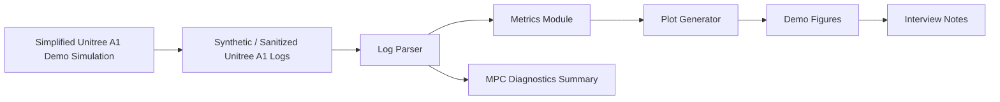

# Architecture

## Module Responsibilities

| Module | Responsibility | Publication boundary |
| --- | --- | --- |
| `simple_sim.py` | Produce deterministic synthetic Unitree A1 sequences | Not real dynamics |
| `generate_sample_data.py` | Write sanitized CSV logs | No raw logs |
| `log_parser.py` | Validate required fields and model name | No non-public format dependency |
| `metrics.py` | Calculate demo metrics | No performance claim |
| `plots.py` | Generate demo figures | Captions/titles identify synthetic data |
| `scripts/` | Provide runnable commands | No Isaac, ROS, or SDK dependency |

## State Matrix

| State group | Fields | Why it is useful |
| --- | --- | --- |
| Time and identity | `step`, `timestamp`, `run_id`, `robot_model` | Keeps runs reproducible and confirms the Unitree A1 framing |
| Body motion | `forward_displacement`, `base_height`, `roll`, `pitch`, `yaw` | Shows short-horizon progression and attitude diagnostics |
| Tracking | `command_vx`, `measured_vx`, `tracking_error` | Separates intent from measured demo behavior |
| MPC gate | `mpc_accepted`, `mpc_rejected`, `mpc_cost` | Demonstrates feasibility-style diagnostics |
| Support force | Four predicted support-force fields | Shows leg-level comparison for discussion |
| Contacts | Four contact fields | Enables simplified duty-factor metrics |

