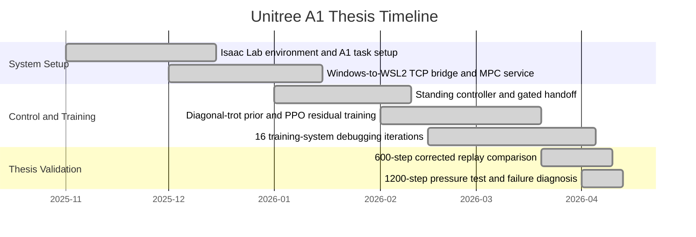

# Project Overview

This repository is a sanitized Unitree A1 robotics simulation-control showcase. It is intended for engineering review, not for reproducing a non-public source project.

The code is organized around a public-safe workflow:

- `simple_sim.py` creates deterministic synthetic Unitree A1 state sequences.
- `log_parser.py` validates a stable CSV schema.
- `metrics.py` computes demo metrics from the normalized logs.
- `plots.py` generates 600-step figures for analysis.
- `tests/` checks parser behavior, metrics, data fields, and pipeline smoke behavior.

The figure path mirrors a thesis-review style report: 600-step forward displacement, base height, roll/pitch, MPC accept/reject, predicted support force, cost trend, and velocity tracking. These plots come from sanitized synthetic data and do not represent real experimental conclusions.

## Verified Thesis Metrics

The following numbers are text references from the verified thesis scope. They are not generated by this public synthetic-data repository:

| Metric | Verified value |
| --- | --- |
| 600-step corrected replay | PPO `model_298.pt` +0.9338 m; hardcoded diagonal-trot baseline +0.9339 m; MPC defaults +0.7915 m |
| 1200-step pressure test | Policy and baseline both failed around 872 steps |
| Debugging process | 16 training-system debugging iterations; key finding: `mpc_rate_div` 6->1 |
| Root-cause chain | yaw drift about 0.9 deg/step -> CoM projection drift along FL-to-RR line (corr=0.98) -> roll/pitch recovery degradation -> FR frictionCone cost spike -> solver rejection |

The showcase can be extended by adding adapters for public simulator exports, ROS bag-derived CSV files, Isaac-style logs, or controller diagnostics. Those integrations are outside this demo scope and should pass a sanitization review before publication.

## Mermaid Gantt

