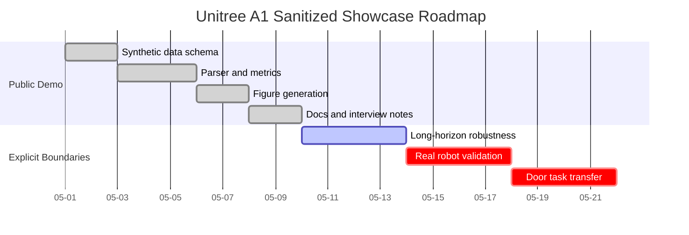

# Project Overview

This repository is a sanitized Unitree A1 robotics simulation-control showcase. It is intended for interview discussion and engineering review, not for reproducing a non-public source project.

The code is organized around a public-safe workflow:

- `simple_sim.py` creates deterministic synthetic Unitree A1 state sequences.
- `log_parser.py` validates a stable CSV schema.
- `metrics.py` computes demo metrics from the normalized logs.
- `plots.py` generates 600-step figures for analysis.
- `tests/` checks parser behavior, metrics, data fields, and pipeline smoke behavior.

The figure path mirrors a paper-progress style report: 600-step forward displacement, base height, roll/pitch, MPC accept/reject, predicted support force, cost trend, and velocity tracking. These plots come from sanitized synthetic data and do not represent real experimental conclusions.

The showcase can be extended by adding adapters for public simulator exports, ROS bag-derived CSV files, Isaac-style logs, or controller diagnostics. Those integrations are outside this demo scope and should pass a sanitization review before publication.

## Mermaid Gantt

